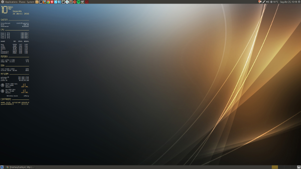

# Conky config files

## Description

This repo contains my conky scripts file. You are free to share and use it at your own risk.

## Requirements

`sudo apt-get install conky faenza-icon-theme`

## Reference

* https://github.com/brndnmtthws/conky (conky)
* http://www.fontspace.com/category/led (fonts)
* http://www.hdwallpapers.in/dark_aurora-wallpapers.html (wallpaper)

## Configuration

Just download to your homedir

`git clone https://github.com/rramos/conkyrc.git`

In order to setup correctly in automatic startup applications you should use the supplied `conky_startup.sh` script wrapper due to identified bug.

## Other Customizations

* **Icons setup** Faenza-Dark
* **Window Manager:**  `Marco` without composite in **Mate Tweaks**

## Thumbnail ##

 
